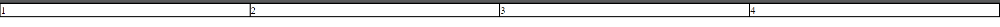
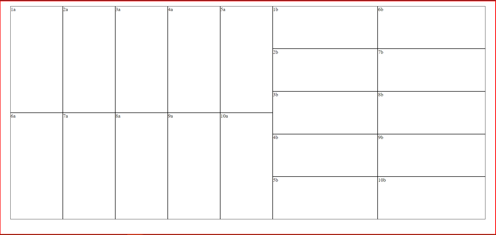

# Venux

Framework to structure the content of the web, for learning purposes.

## Getting Start

### Manual Installation
> <link rel="stylesheet" href="dist/venux.min.css">

## NPM Installation
> npm i venux

### How To Use

```html
<!-- Custom Style -->
<style>
    .rejilla {
        border: 1px solid black;
    }
    /*simulation of content */
    .text {
        height: 20%;
    }
</style>
```

```html
<div class="row">
    <div class="item-small rejilla">1</div>
    <div class="item-small rejilla">2</div>
    <div class="item-small rejilla">3</div>
    <div class="item-small rejilla">4</div>
</div>
```



```html
<div class="container fill-normal">
    <div class="row">
        <div class="rejilla item">1a</div>
        <div class="rejilla item">2a</div>
        <div class="rejilla item">3a</div>
        <div class="rejilla item">4a</div>
        <div class="rejilla item">5a</div>
        <div class="rejilla item">6a</div>
        <div class="rejilla item">7a</div>
        <div class="rejilla item">8a</div>
        <div class="rejilla item">9a</div>
        <div class="rejilla item">10a</div>
    </div>
    <div class="column">
        <div class="rejilla text">1b</div>
        <div class="rejilla text">2b</div>
        <div class="rejilla text">3b</div>
        <div class="rejilla text">4b</div>
        <div class="rejilla text">5b</div>
        <div class="rejilla text">6b</div>
        <div class="rejilla text">7b</div>
        <div class="rejilla text">8b</div>
        <div class="rejilla text">9b</div>
        <div class="rejilla text">10b</div>
    </div>
</div>
```



### Layout

-   column
-   row
